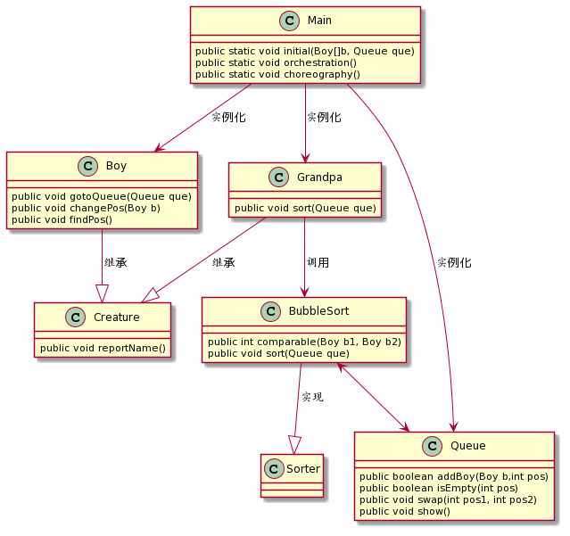

# OOAdvanced

## 1. UML图



## 2. orchestration sort 过程

    - 初始化葫芦娃
    - 让所有葫芦娃进入队列
    - 老爷爷对队列进行排序
    - 老爷爷判断某两个葫芦娃需要交换位置，通知这两个葫芦娃交换
    - 葫芦娃对象通过交换的方法进行交换

```
    Boy[]b=new Boy[7];
    Queue que=new Queue(7);
    initial(b,que);
    Grandpa grandpa=new Grandpa();
    grandpa.sort(que);
```

## 3. choreography sort 过程

    - 初始化葫芦娃
    - 让所有葫芦娃进入队列
    - 让所有葫芦娃自己找到在队伍中应该的位置
    - 由于每个葫芦娃知道自己的rank且主动进行排序过程，排序算法是不必要的

```
    Boy[]b=new Boy[7];
    Queue que=new Queue(7);
    initial(b,que);
    for(int i=0;i<7;i++)
    {
        b[i].findPos();
    }
```

## 4. 运行结果

```
| orchestration sort |
老大 has entered the queue.
老二 has entered the queue.
老三 has entered the queue.
老四 has entered the queue.
老五 has entered the queue.
老六 has entered the queue.
老七 has entered the queue.
before sort, the queue is:
老三 老四 老二 老大 老六 老七 老五
老爷爷 is ready to organize now...
老四 listens to the grandpa and wants to change position with 老二
老四 changes position with 老二, and the queue is:
老三 老二 老四 老大 老六 老七 老五
老四 listens to the grandpa and wants to change position with 老大
老四 changes position with 老大, and the queue is:
老三 老二 老大 老四 老六 老七 老五
老七 listens to the grandpa and wants to change position with 老五
老七 changes position with 老五, and the queue is:
老三 老二 老大 老四 老六 老五 老七
老三 listens to the grandpa and wants to change position with 老二
老三 changes position with 老二, and the queue is:
老二 老三 老大 老四 老六 老五 老七
老三 listens to the grandpa and wants to change position with 老大
老三 changes position with 老大, and the queue is:
老二 老大 老三 老四 老六 老五 老七
老六 listens to the grandpa and wants to change position with 老五
老六 changes position with 老五, and the queue is:
老二 老大 老三 老四 老五 老六 老七
老二 listens to the grandpa and wants to change position with 老大
老二 changes position with 老大, and the queue is:
老大 老二 老三 老四 老五 老六 老七
after sort, the queue is:
老大 老二 老三 老四 老五 老六 老七
---------------------------------------------------
| choreography sort process |
老大 has entered the queue.
老二 has entered the queue.
老三 has entered the queue.
老四 has entered the queue.
老五 has entered the queue.
老六 has entered the queue.
老七 has entered the queue.
before sort, the queue is:
老三 老六 老五 老大 老二 老七 老四
老大 wants to change position with 老三
老大 changes position with 老三, and the queue is:
老大 老六 老五 老三 老二 老七 老四
老二 wants to change position with 老六
老二 changes position with 老六, and the queue is:
老大 老二 老五 老三 老六 老七 老四
老三 wants to change position with 老五
老三 changes position with 老五, and the queue is:
老大 老二 老三 老五 老六 老七 老四
老四 wants to change position with 老五
老四 changes position with 老五, and the queue is:
老大 老二 老三 老四 老六 老七 老五
老五 wants to change position with 老六
老五 changes position with 老六, and the queue is:
老大 老二 老三 老四 老五 老七 老六
老六 wants to change position with 老七
老六 changes position with 老七, and the queue is:
老大 老二 老三 老四 老五 老六 老七
after sort, the queue is:
老大 老二 老三 老四 老五 老六 老七
---------------------------------------------------

```

## 5. 封装、继承和多态

    - Creature, Boy, Grandpa等类通过对方法的定义实现了功能封装
    - Boy, Grandpa类继承Creature类
    - Boy, Grandpa类重写了Creature类中的info()方法，实现多态

## 6. 接口

    - Sorter是一个接口
    - BubbleSort类是接口的一个具体算法实现

## 7. 构造器

    - 父类Creature有自己的含参构造器
    - 子类Boy和Grandpa中的含参构造器通过super方法调用父类含参构造器

## 8. 静态变量和静态块

    - Boy类中设置静态变量对葫芦娃总数计数
    - 通过静态块中代码对静态变量初始化

## 9. 包和修饰符

    - 将整体逻辑抽象为control、map和object，分为3个包
    - 各个类中使用了final、private、public等修饰符对变量进行保护或公开
